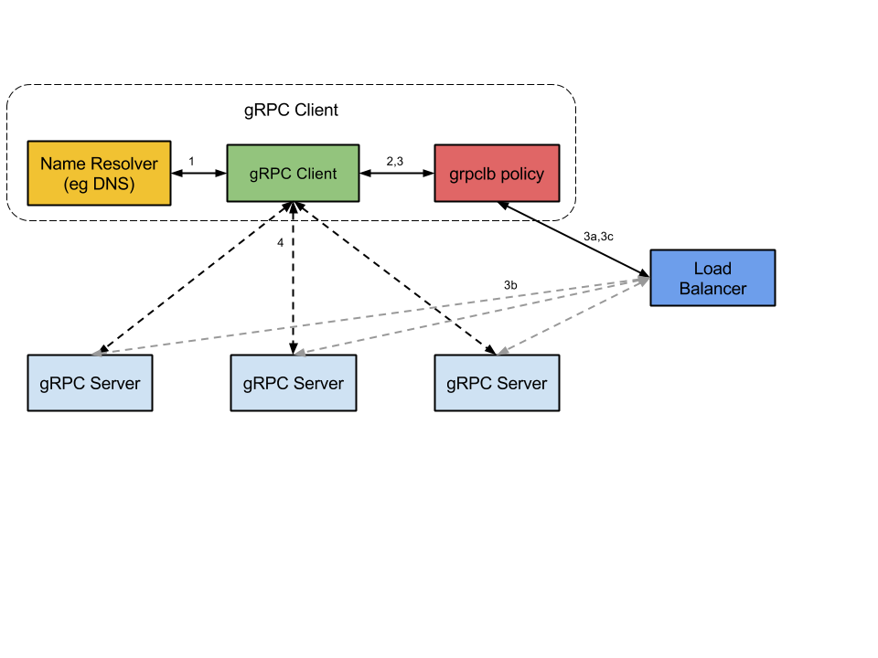

* [负载均衡选择](#负载均衡选择)
	* [代理还是客户端？](#代理还是客户端)
	* [比较](#比较)
	* [代理负载均衡选项](#代理负载均衡选项)
	* [L3 / L4（传输层）与L7（应用）](#l3-l4传输层与l7应用)
	* [客户端负载均衡选项](#客户端负载均衡选项)
		* [重客户端](#重客户端)
		* [grpc客户端负载均衡](#grpc客户端负载均衡)
		* [代码实现](#代码实现)
		* [源码解析](#源码解析)
* [总结](#总结)

> 构建高可用、高性能的通信服务，通常采用服务注册与发现、负载均衡和容错处理等机制实现。根据负载均衡实现所在的位置不同，通常可分为以下三种解决方案

## 负载均衡选择

### 代理还是客户端？

注意：在某些文献中，代理负载平衡也称为服务器端负载平衡。

在代理与客户端负载平衡之间进行选择是主要的架构选择。 在代理负载平衡中，客户端向负载均衡器（LB）代理发出RPC。 LB将RPC调用分配给可用的后端服务器之一，后端服务器实现服务调用的实际逻辑。 LB跟踪每个后端的负载，并实现公平分配负载的算法。 客户端自己不了解后端服务器。 客户可能不受信任。 此体系结构通常用于面向用户的服务，其中来自开放式Internet的客户端可以连接到数据中心中的服务器，如下图所示。 在这种情况下，客户端向LB发出请求（＃1）。 LB将请求传递给其中一个后端（＃2），后端报告加载到LB（＃3）。


在客户端负载平衡中，客户端知道多个后端服务器，并选择一个用于每个RPC。 客户端从后端服务器获取负载报告，客户端实现负载平衡算法。 在更简单的配置中，不考虑服务器负载，客户端只能在可用服务器之间进行循环。 如下图所示。 如您所见，客户端向特定后端发出请求（＃1）。 后端响应负载信息（＃2），通常在执行客户端RPC的同一连接上。 然后客户端更新其内部状态。


### 比较


### 代理负载均衡选项

代理负载平衡可以是L3 / L4（传输级别）或L7（应用级别）。在传输级负载平衡中，服务器终止TCP连接并打开与所选后端的另一个连接。应用程序数据（HTTP / 2和gRPC帧）只是在客户端连接到后端连接之间复制。 L3 / L4 LB设计的处理非常少，与L7 LB相比延迟更少，并且因为它消耗更少的资源而更便宜。

在L7（应用程序级别）负载平衡中，LB终止并解析HTTP / 2协议。 LB可以检查每个请求并根据请求内容分配后端。例如，作为HTTP标头的一部分发送的会话cookie可用于与特定后端关联，因此该会话的所有请求都由同一后端提供。一旦LB选择了适当的后端，它就会为该后端创建一个新的HTTP / 2连接。然后，它将从客户端接收的HTTP / 2流转发到所选择的后端。使用HTTP / 2，LB可以在多个后端之间分配来自一个客户端的流。

### L3 / L4（传输层）与L7（应用）


### 客户端负载均衡选项

#### 重客户端

胖客户端方法意味着在客户端中实现负载平衡智能。 客户端负责跟踪可用服务器，其工作负载以及用于选择服务器的算法。 客户端通常集成与其他基础结构通信的库，例如服务发现，名称解析，配额管理等。

#### grpc客户端负载均衡

gRPC开源组件官方并未直接提供服务注册与发现的功能实现，但其设计文档已提供实现的思路，并在不同语言的gRPC代码API中已提供了命名解析和负载均衡接口供扩展。



其基本实现原理：

 1. 服务启动后gRPC客户端向命名服务器发出名称解析请求，名称将解析为一个或多个IP地址，每个IP地址标示它是服务器地址还是负载均衡器地址，以及标示要使用那个客户端负载均衡策略或服务配置。
 2. 客户端实例化负载均衡策略，如果解析返回的地址是负载均衡器地址，则客户端将使用grpclb策略，否则客户端使用服务配置请求的负载均衡策略。
 3. 负载均衡策略为每个服务器地址创建一个子通道（channel）。
 4. 当有rpc请求时，负载均衡策略决定那个子通道即grpc服务器将接收请求，当可用服务器为空时客户端的请求将被阻塞。

根据gRPC官方提供的设计思路，基于进程内LB方案（即第2个案，阿里开源的服务框架 Dubbo 也是采用类似机制），结合分布式一致的组件（如Zookeeper、Consul、Etcd），可找到gRPC服务发现和负载均衡的可行解决方案。简单介绍下基于Etcd3的关键代码实现：

#### 代码实现

命名解析实现：resolver.go

``` golang
package balancer

import (
	"context"
	"log"
	"strings"
	"time"

	"github.com/coreos/etcd/clientv3"
	"github.com/coreos/etcd/mvcc/mvccpb"
	"google.golang.org/grpc/resolver"
)

const schema = "wonamingv3"

var cli *clientv3.Client

type etcdResolver struct {
	rawAddr string
	cc      resolver.ClientConn
}

// NewResolver initialize an etcd client
func NewResolver(etcdAddr string) resolver.Builder {
	return &etcdResolver{rawAddr: etcdAddr}
}

func (r *etcdResolver) Build(target resolver.Target, cc resolver.ClientConn, opts resolver.BuildOption) (resolver.Resolver, error) {
	var err error

	if cli == nil {
		cli, err = clientv3.New(clientv3.Config{
			Endpoints:   strings.Split(r.rawAddr, ";"),
			DialTimeout: 15 * time.Second,
		})
		if err != nil {
			return nil, err
		}
	}

	r.cc = cc

	go r.watch("/" + target.Scheme + "/" + target.Endpoint + "/")

	return r, nil
}

func (r etcdResolver) Scheme() string {
	return schema
}

func (r etcdResolver) ResolveNow(rn resolver.ResolveNowOption) {
	log.Println("ResolveNow") // TODO check
}

// Close closes the resolver.
func (r etcdResolver) Close() {
	log.Println("Close")
}

func (r *etcdResolver) watch(keyPrefix string) {
	var addrList []resolver.Address

	getResp, err := cli.Get(context.Background(), keyPrefix, clientv3.WithPrefix())
	if err != nil {
		log.Println(err)
	} else {
		for i := range getResp.Kvs {
			addrList = append(addrList, resolver.Address{Addr: strings.TrimPrefix(string(getResp.Kvs[i].Key), keyPrefix)})
		}
	}

	r.cc.NewAddress(addrList)

	rch := cli.Watch(context.Background(), keyPrefix, clientv3.WithPrefix())
	for n := range rch {
		for _, ev := range n.Events {
			addr := strings.TrimPrefix(string(ev.Kv.Key), keyPrefix)
			switch ev.Type {
			case mvccpb.PUT:
				if !exist(addrList, addr) {
					addrList = append(addrList, resolver.Address{Addr: addr})
					r.cc.NewAddress(addrList)
				}
			case mvccpb.DELETE:
				if s, ok := remove(addrList, addr); ok {
					addrList = s
					r.cc.NewAddress(addrList)
				}
			}
			//log.Printf("%s %q : %q\n", ev.Type, ev.Kv.Key, ev.Kv.Value)
		}
	}
}

func exist(l []resolver.Address, addr string) bool {
	for i := range l {
		if l[i].Addr == addr {
			return true
		}
	}
	return false
}

func remove(s []resolver.Address, addr string) ([]resolver.Address, bool) {
	for i := range s {
		if s[i].Addr == addr {
			s[i] = s[len(s)-1]
			return s[:len(s)-1], true
		}
	}
	return nil, false
}

```

服务注册实现：naming.go

``` golang
package balancer

import (
	"context"
	"log"
	"strings"
	"time"

	"github.com/coreos/etcd/clientv3"
	"fmt"
)

// Register register service with name as prefix to etcd, multi etcd addr should use ; to split
func Register(etcdAddr, name string, addr string, ttl int64) error {
	var err error

	if cli == nil {
		cli, err = clientv3.New(clientv3.Config{
			Endpoints:   strings.Split(etcdAddr, ";"),
			DialTimeout: 15 * time.Second,
		})
		if err != nil {
			return err
		}
	}

	ticker := time.NewTicker(time.Second * time.Duration(ttl))

	go func() {
		for {
			getResp, err := cli.Get(context.Background(), "/"+schema+"/"+name+"/"+addr)
			if err != nil {
				log.Println(err)
			} else if getResp.Count == 0 {
				err = withAlive(name, addr, ttl)
				if err != nil {
					log.Println(err)
				}
			} else {
				// do nothing
			}

			<-ticker.C
		}
	}()

	return nil
}

func withAlive(name string, addr string, ttl int64) error {
	leaseResp, err := cli.Grant(context.Background(), ttl)
	if err != nil {
		return err
	}

	fmt.Printf("key:%v\n", "/"+schema+"/"+name+"/"+addr)
	_, err = cli.Put(context.Background(), "/"+schema+"/"+name+"/"+addr, addr, clientv3.WithLease(leaseResp.ID))
	if err != nil {
		return err
	}

	_, err = cli.KeepAlive(context.Background(), leaseResp.ID)
	if err != nil {
		return err
	}
	return nil
}

// UnRegister remove service from etcd
func UnRegister(name string, addr string) {
	if cli != nil {
		cli.Delete(context.Background(), "/"+schema+"/"+name+"/"+addr)
	}
}
```

服务端：main.go

``` golang
package main

import (
	"flag"
	"log"
	"net"
	"os"
	"os/signal"
	"syscall"

	"grpc/balancer"
	"../pb"

	"golang.org/x/net/context"
	"google.golang.org/grpc"
)

const svcName = "project/test"

var addr = "127.0.0.1:50051"

func main() {
	flag.StringVar(&addr, "addr", addr, "addr to lis")
	flag.Parse()

	lis, err := net.Listen("tcp", addr)
	if err != nil {
		log.Fatalf("failed to listen: %s", err)
	}
	defer lis.Close()

	s := grpc.NewServer()
	defer s.GracefulStop()

	pb.RegisterHelloServiceServer(s, &hello{})

	go balancer.Register("127.0.0.1:2379", svcName, addr, 5)

	ch := make(chan os.Signal, 1)
	signal.Notify(ch, syscall.SIGTERM, syscall.SIGINT, syscall.SIGKILL, syscall.SIGHUP, syscall.SIGQUIT)
	go func() {
		s := <-ch
		balancer.UnRegister(svcName, addr)

		if i, ok := s.(syscall.Signal); ok {
			os.Exit(int(i))
		} else {
			os.Exit(0)
		}

	}()

	if err := s.Serve(lis); err != nil {
		log.Fatalf("failed to serve: %s", err)
	}
}

type hello struct {
}

func (*hello) Echo(ctx context.Context, req *pb.Payload) (*pb.Payload, error) {
	req.Data = req.Data + ", from:" + addr
	return req, nil
}

```

客户端：main.go

``` golang
package main

import (
	"fmt"
	"time"

	"grpc/balancer"
	"grpc/balancer/pb"

	"golang.org/x/net/context"
	"google.golang.org/grpc"
	"google.golang.org/grpc/resolver"
)

func main() {
	r := balancer.NewResolver("localhost:2378")
	resolver.Register(r)

	conn, err := grpc.Dial(r.Scheme()+"://author/project/test", grpc.WithBalancerName("round_robin"), grpc.WithInsecure())
	if err != nil {
		panic(err)
	}

	client := pb.NewHelloServiceClient(conn)

	for {
		resp, err := client.Echo(context.Background(), &pb.Payload{Data: "hello"}, grpc.FailFast(true))
		if err != nil {
			fmt.Println(err)
		} else {
			fmt.Println(resp)
		}

		<-time.After(time.Second)
	}
}
```

#### 源码解析

使用的grpc-go的版本为1.14.0
etcd版本为3.2.0

首先实现了一个命名解析器：etcdResolver。实现了Builder和Resolver接口

``` golang
// Builder creates a resolver that will be used to watch name resolution updates.
type Builder interface {
	// Build creates a new resolver for the given target.
	//
	// gRPC dial calls Build synchronously, and fails if the returned error is
	// not nil.
	Build(target Target, cc ClientConn, opts BuildOption) (Resolver, error)
	// Scheme returns the scheme supported by this resolver.
	// Scheme is defined at https://github.com/grpc/grpc/blob/master/doc/naming.md.
	Scheme() string
}
```


``` golang
// Resolver watches for the updates on the specified target.
// Updates include address updates and service config updates.
type Resolver interface {
	// ResolveNow will be called by gRPC to try to resolve the target name
	// again. It's just a hint, resolver can ignore this if it's not necessary.
	//
	// It could be called multiple times concurrently.
	ResolveNow(ResolveNowOption)
	// Close closes the resolver.
	Close()
}
```

Builder接口在发起rpc请求的时候会调用Build方法。etcdResolver的Build方法首先创建一条到etcd服务端的连接。然后启动一个goroutine watch相应的key上是否有变更，如果有，根据不同的event进行不同的处理

``` golang
func (r *etcdResolver) watch(keyPrefix string) {
	var addrList []resolver.Address

	getResp, err := cli.Get(context.Background(), keyPrefix, clientv3.WithPrefix())
	if err != nil {
		log.Println(err)
	} else {
		for i := range getResp.Kvs {
			addrList = append(addrList, resolver.Address{Addr: strings.TrimPrefix(string(getResp.Kvs[i].Key), keyPrefix)})
		}
	}

   // 更新地址列表
	r.cc.NewAddress(addrList)

	rch := cli.Watch(context.Background(), keyPrefix, clientv3.WithPrefix())
	for n := range rch {
		for _, ev := range n.Events {
			addr := strings.TrimPrefix(string(ev.Kv.Key), keyPrefix)
			switch ev.Type {
			case mvccpb.PUT:
				if !exist(addrList, addr) {
					addrList = append(addrList, resolver.Address{Addr: addr})
					// 更新地址列表
					r.cc.NewAddress(addrList)
				}
			case mvccpb.DELETE:
				if s, ok := remove(addrList, addr); ok {
					addrList = s
					// 更新地址列表
					r.cc.NewAddress(addrList)
				}
			}
			//log.Printf("%s %q : %q\n", ev.Type, ev.Kv.Key, ev.Kv.Value)
		}
	}
}
```


etcdResolver watch的key同时也是注册方操作的key。当有服务器启动时，调用etcdv3 api的put函数，更新相关信息。当服务器关机时，调用delete函数

``` golang
func withAlive(name string, addr string, ttl int64) error {
	leaseResp, err := cli.Grant(context.Background(), ttl)
	if err != nil {
		return err
	}

	fmt.Printf("key:%v\n", "/"+schema+"/"+name+"/"+addr)
	_, err = cli.Put(context.Background(), "/"+schema+"/"+name+"/"+addr, addr, clientv3.WithLease(leaseResp.ID))
	if err != nil {
		return err
	}

	_, err = cli.KeepAlive(context.Background(), leaseResp.ID)
	if err != nil {
		return err
	}
	return nil
}

// UnRegister remove service from etcd
func UnRegister(name string, addr string) {
	if cli != nil {
		cli.Delete(context.Background(), "/"+schema+"/"+name+"/"+addr)
	}
}
```

服务端的原理很简单，启动的时候调用注册的方法，停止的时候注销

``` golang
go balancer.Register("127.0.0.1:2379", svcName, addr, 5)

	ch := make(chan os.Signal, 1)
	signal.Notify(ch, syscall.SIGTERM, syscall.SIGINT, syscall.SIGKILL, syscall.SIGHUP, syscall.SIGQUIT)
	go func() {
		s := <-ch
		balancer.UnRegister(svcName, addr)

		if i, ok := s.(syscall.Signal); ok {
			os.Exit(int(i))
		} else {
			os.Exit(0)
		}

	}()

```

整个的服务发现和负载均衡都交给了客户端来做，这里的底层代码很复杂，尤其是涉及到grpc部分。如果是带着疑问去看的话，可能效果更好些。

问题：

 1. 当有服务器上线时，请求能顺利的转发到新上线的服务器吗？
 2. 当有服务器关机时，请求还会向这台服务器转发吗？
 3. grpc底层是怎么维护多个连接的？
 4. 调用方如果只dial一次，维护一个client。如果服务器产生了变化，请求能否自动转发？

客户端代码：

``` golang 
func main() {
	r := balancer.NewResolver("localhost:2379")
	resolver.Register(r)

	conn, err := grpc.Dial(r.Scheme()+"://author/project/test", grpc.WithBalancerName("round_robin"), grpc.WithInsecure())
	if err != nil {
		panic(err)
	}

	client := pb.NewHelloServiceClient(conn)

	for {
		resp, err := client.Echo(context.Background(), &pb.Payload{Data: "hello"}, grpc.FailFast(true))
		if err != nil {
			fmt.Println(err)
		} else {
			fmt.Println(resp)
		}

		<-time.After(time.Second)
	}
}
```

客户端使用了自实现的命名解析器etcdResolver。使用的负载均衡器为grpc自带的round robin。客户端代码很简洁，grpc的封装带来了很大的便捷性，也方便推广。但是想真正了解原理，还需要深入到grpc源码。首先看看Dial函数：

``` golang
// Dial creates a client connection to the given target.
func Dial(target string, opts ...DialOption) (*ClientConn, error) {
	return DialContext(context.Background(), target, opts...)
}

func DialContext(ctx context.Context, target string, opts ...DialOption) (conn *ClientConn, err error) {
    // 初始化客户端连接
    cc := &ClientConn{
		target:         target,
		csMgr:          &connectivityStateManager{},
		conns:          make(map[*addrConn]struct{}),
		dopts:          defaultDialOptions(),
		blockingpicker: newPickerWrapper(),
	}
	
	...
	// 初始化opts
	...
	
	// 设置resolver
	// 客户端调用了resolver.Register(r)函数，注册了实例
	
	if cc.dopts.resolverBuilder == nil {
		// Only try to parse target when resolver builder is not already set.
		cc.parsedTarget = parseTarget(cc.target)
		grpclog.Infof("parsed scheme: %q", cc.parsedTarget.Scheme)
		// 此处调用get方法获取resolver
		cc.dopts.resolverBuilder = resolver.Get(cc.parsedTarget.Scheme)
		if cc.dopts.resolverBuilder == nil {
			// If resolver builder is still nil, the parse target's scheme is
			// not registered. Fallback to default resolver and set Endpoint to
			// the original unparsed target.
			grpclog.Infof("scheme %q not registered, fallback to default scheme", cc.parsedTarget.Scheme)
			cc.parsedTarget = resolver.Target{
				Scheme:   resolver.GetDefaultScheme(),
				Endpoint: target,
			}
			cc.dopts.resolverBuilder = resolver.Get(cc.parsedTarget.Scheme)
		}
	} else {
		cc.parsedTarget = resolver.Target{Endpoint: target}
	}
	
	// 构建resolver
	cc.resolverWrapper, err = newCCResolverWrapper(cc)
	
	// 启动resolver
	cc.resolverWrapper.start()
}
```


``` golang
// newCCResolverWrapper parses cc.target for scheme and gets the resolver
// builder for this scheme and builds the resolver. The monitoring goroutine
// for it is not started yet and can be created by calling start().
//
// If withResolverBuilder dial option is set, the specified resolver will be
// used instead.
func newCCResolverWrapper(cc *ClientConn) (*ccResolverWrapper, error) {
    // 获取resolver实例，此处为客户端实现的etcdResolver
	rb := cc.dopts.resolverBuilder
	if rb == nil {
		return nil, fmt.Errorf("could not get resolver for scheme: %q", cc.parsedTarget.Scheme)
	}

	ccr := &ccResolverWrapper{
		cc:     cc,
		addrCh: make(chan []resolver.Address, 1),
		scCh:   make(chan string, 1),
		done:   make(chan struct{}),
	}

	var err error
	// 此处为Build接口的调用处，构建成功后返回解析器
	ccr.resolver, err = rb.Build(cc.parsedTarget, ccr, resolver.BuildOption{DisableServiceConfig: cc.dopts.disableServiceConfig})
	if err != nil {
		return nil, err
	}
	return ccr, nil
}

```

// 启动一个watcher goroutine
``` golang
func (ccr *ccResolverWrapper) start() {
	fmt.Printf("go wrapper watcher\n")
	go ccr.watcher()
}
```


``` golang
// watcher processes address updates and service config updates sequentially.
// Otherwise, we need to resolve possible races between address and service
// config (e.g. they specify different balancer types).
func (ccr *ccResolverWrapper) watcher() {
	for {
		select {
		case <-ccr.done:
			return
		default:
		}

       // 读取addrCh中的数据
		select {
		case addrs := <-ccr.addrCh:
			select {
			case <-ccr.done:
				return
			default:
			}
			grpclog.Infof("ccResolverWrapper: sending new addresses to cc: %v", addrs)
			ccr.cc.handleResolvedAddrs(addrs, nil)
		case sc := <-ccr.scCh:
			select {
			case <-ccr.done:
				return
			default:
			}
			grpclog.Infof("ccResolverWrapper: got new service config: %v", sc)
			ccr.cc.handleServiceConfig(sc)
		case <-ccr.done:
			return
		}
	}
}
```

ccResolverWrapper包裹了clientConn，实现了resolver.ClientConnection。包括NewAddress

``` golang
// ccResolverWrapper is a wrapper on top of cc for resolvers.
// It implements resolver.ClientConnection interface.
type ccResolverWrapper struct {
	cc       *ClientConn
	resolver resolver.Resolver
	addrCh   chan []resolver.Address
	scCh     chan string
	done     chan struct{}
}
```


``` golang
// NewAddress is called by the resolver implemenetion to send addresses to gRPC.
func (ccr *ccResolverWrapper) NewAddress(addrs []resolver.Address) {
	select {
	case <-ccr.addrCh:
	default:
	}
	ccr.addrCh <- addrs
}
```

NewAddress方法将地址发送给addrCh channel。当有服务器状态更新的时候，此方法在etcdResolver中会调用。

resolverWrapper的watcher方法读取addrCh，当有数据的时候调用handleResolvedAddrs方法

``` golang
func (cc *ClientConn) handleResolvedAddrs(addrs []resolver.Address, err error) {
	cc.mu.Lock()
	defer cc.mu.Unlock()
	if cc.conns == nil {
		// cc was closed.
		return
	}

    // 比较当前存储的地址是否和resolver中获得的地址一样，
    // 如果是一样的，直接返回。说明目前没有更新，不需要重新build balancer 
	if reflect.DeepEqual(cc.curAddresses, addrs) {
		return
	}

	cc.curAddresses = addrs

	if cc.dopts.balancerBuilder == nil {
		// Only look at balancer types and switch balancer if balancer dial
		// option is not set.
		var isGRPCLB bool
		for _, a := range addrs {
			if a.Type == resolver.GRPCLB {
				isGRPCLB = true
				break
			}
		}
		var newBalancerName string
		if isGRPCLB {
			newBalancerName = grpclbName
		} else {
			// Address list doesn't contain grpclb address. Try to pick a
			// non-grpclb balancer.
			newBalancerName = cc.curBalancerName
			// If current balancer is grpclb, switch to the previous one.
			if newBalancerName == grpclbName {
				newBalancerName = cc.preBalancerName
			}
			// The following could be true in two cases:
			// - the first time handling resolved addresses
			//   (curBalancerName="")
			// - the first time handling non-grpclb addresses
			//   (curBalancerName="grpclb", preBalancerName="")
			if newBalancerName == "" {
				newBalancerName = PickFirstBalancerName
			}
		}
		cc.switchBalancer(newBalancerName)
	} else if cc.balancerWrapper == nil {
		// Balancer dial option was set, and this is the first time handling
		// resolved addresses. Build a balancer with dopts.balancerBuilder.
		// 生成实例化的balancer
		cc.balancerWrapper = newCCBalancerWrapper(cc, cc.dopts.balancerBuilder, cc.balancerBuildOpts)
	}

	cc.balancerWrapper.handleResolvedAddrs(addrs, nil)
}

```

newCCBalancerWrapper根据传入的参数实例化balancer。

``` golang
func newCCBalancerWrapper(cc *ClientConn, b balancer.Builder, bopts balancer.BuildOptions) *ccBalancerWrapper {
	ccb := &ccBalancerWrapper{
		cc:               cc,
		stateChangeQueue: newSCStateUpdateBuffer(),
		resolverUpdateCh: make(chan *resolverUpdate, 1),
		done:             make(chan struct{}),
		subConns:         make(map[*acBalancerWrapper]struct{}),
	}
	go ccb.watcher()
	// 调用build接口实例化balancer
	ccb.balancer = b.Build(ccb, bopts)
	return ccb
}
```

这里使用的balancer是grpc自带的round-robin负载均衡组件，实现了balancer.Builder接口

``` golang
// Name is the name of round_robin balancer.
const Name = "round_robin"

// newBuilder creates a new roundrobin balancer builder.
func newBuilder() balancer.Builder {
	return base.NewBalancerBuilder(Name, &rrPickerBuilder{})
}

func init() {
	balancer.Register(newBuilder())
}

func (bb *baseBuilder) Build(cc balancer.ClientConn, opt balancer.BuildOptions) balancer.Balancer {
	return &baseBalancer{
		cc:            cc,
		pickerBuilder: bb.pickerBuilder,

		subConns: make(map[resolver.Address]balancer.SubConn),
		scStates: make(map[balancer.SubConn]connectivity.State),
		csEvltr:  &connectivityStateEvaluator{},
		// Initialize picker to a picker that always return
		// ErrNoSubConnAvailable, because when state of a SubConn changes, we
		// may call UpdateBalancerState with this picker.
		picker: NewErrPicker(balancer.ErrNoSubConnAvailable),
	}
}

```

其实到这里可以发现resolver和balancer的实现和调用模式都是非常像的。客户端负责实现接口和register，调用者负责实例化。
grpc在使用的时候通过Get函数获取当前register的实例，然后调用相应的接口实例化

同样的，balancerWrapper也有一个watch方法。resolver解析到的地址会塞入到resolverUpdateCh channel。

``` golang
case t := <-ccb.resolverUpdateCh:
			select {
			case <-ccb.done:
				ccb.balancer.Close()
				return
			default:
			}
			ccb.balancer.HandleResolvedAddrs(t.addrs, t.err)
```

当从channel中读取到数据时，调用HandleResolveAddrs方法

``` golang

type baseBalancer struct {
	cc            balancer.ClientConn
	pickerBuilder PickerBuilder

	csEvltr *connectivityStateEvaluator
	state   connectivity.State

	subConns map[resolver.Address]balancer.SubConn  // 子连接池
	scStates map[balancer.SubConn]connectivity.State
	picker   balancer.Picker   //选择器
}

func (b *baseBalancer) HandleResolvedAddrs(addrs []resolver.Address, err error) {
	if err != nil {
		grpclog.Infof("base.baseBalancer: HandleResolvedAddrs called with error %v", err)
		return
	}
	grpclog.Infoln("base.baseBalancer: got new resolved addresses: ", addrs)
	// addrsSet is the set converted from addrs, it's used for quick lookup of an address.
	addrsSet := make(map[resolver.Address]struct{})
	for _, a := range addrs {
		addrsSet[a] = struct{}{}
		if _, ok := b.subConns[a]; !ok {
			// a is a new address (not existing in b.subConns).
			sc, err := b.cc.NewSubConn([]resolver.Address{a}, balancer.NewSubConnOptions{})
			if err != nil {
				grpclog.Warningf("base.baseBalancer: failed to create new SubConn: %v", err)
				continue
			}
			// 放入子链接池
			b.subConns[a] = sc
			b.scStates[sc] = connectivity.Idle
			sc.Connect()
		}
	}
}
```

bashBalancer结构中有一个选择器balancer.Picker接口。round_robin实现了rrPicker的Pick接口

``` golang
type rrPicker struct {
	// subConns is the snapshot of the roundrobin balancer when this picker was
	// created. The slice is immutable. Each Get() will do a round robin
	// selection from it and return the selected SubConn.
	subConns []balancer.SubConn

	mu   sync.Mutex
	next int
}

// 轮询算法
func (p *rrPicker) Pick(ctx context.Context, opts balancer.PickOptions) (balancer.SubConn, func(balancer.DoneInfo), error) {
	if len(p.subConns) <= 0 {
		return nil, nil, balancer.ErrNoSubConnAvailable
	}

	p.mu.Lock()
	sc := p.subConns[p.next]
	p.next = (p.next + 1) % len(p.subConns)
	p.mu.Unlock()
	return sc, nil, nil
}
```

rrPicker实现了Pick接口。算法是很简单的轮询操作。

还有最后一个问题：Pick方法是什么时候调用的呢？ 方法嵌套的层次比较多。简单来说是：

invoke --> newClientStream --> newAttemptLocked --> getTransport --> pick

每一次invoke调用会进行一次pick选择。所以客户端只维护一个client也是可以的

## 总结

初步分析了grpc resolver和balancer部分的源码，感触比较大。学到了不少编程思想：

 - 面向接口编程
 - 代理模式（wrapper）
 - 工厂模式

还有很多重要的细节没有研读。有时间还是要继续

