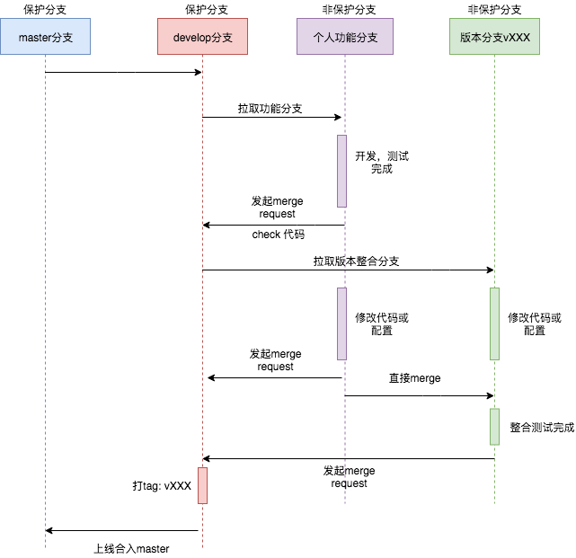

### 目录

* [主分支master](#主分支master)
* [开发分支Develop](#开发分支develop)
* [临时性分支](#临时性分支)
	* [功能分支](#功能分支)
	* [版本分支](#版本分支)
	* [修补bug](#修补bug)
* [例子](#例子)
	* [注意点](#注意点)




### 主分支master

首先，代码库应该有一个、且仅有一个主分支。正式版本，都在这个主分支上发布。
这个分支上的功能是稳定且完全通过测试的

### 开发分支Develop

日常开发应该在另一条分支上完成。我们把开发用的分支，叫做Develop。
这个分支上的功能通过测试但是不稳定，可能会不断的更新

### 临时性分支

 1. 功能（feature）分支
 2. 版本（vxxx) 分支
 3. 修（bug）分支

#### 功能分支

第一种是功能分支，它是为了开发某种特定功能，从Develop分支上面分出来的。开发完成后，要再并入Develop。

功能分支的名字，可以采用feature-*的形式命名。

``` shell
git checkout -b feature-x develop
```

开发完成后，将功能分支合并到develop分支：

``` shell
git checkout develop

git merge --no-ff feature-x
```

#### 版本分支

它是指发布正式版本之前（即合并到Master分支之前），我们可能需要有一个预发布的版本进行测试。

预发布分支是从Develop分支上面分出来的，测试结束待上线以后，必须合并进Develop。它的命名，可以采用v*的形式。

``` shell
git checkout -b v322 develop
```

确认没有问题后，合并到develop分支：

``` shell
git checkout develop
git merge --no-ff v322

# 对合并生成的新节点，做一个标签
git tag -a tag_v322
```

上线的时候将tag_v322合入master分支：
``` shell
git checkout master
git merge tag_v322
```

上线时如果还有其他tag未合入master，需要将之前未上线的版本tag也合入master。比如当前需要上线的版本为v322，同时还存在几个未上线的tag:  tag_v321, tag_v320。这时候需要首先将tag_v321, tag_v320合入到master分支。最后才将tag_v322合入master分支

合入的时候还是要遵循合入原则：先将上游分支合入自己分支，然后再合入上游分支

#### 修补bug

软件正式发布以后，难免会出现bug。这时就需要创建一个分支，进行bug修补。

修补bug分支是从Master分支上面分出来的。修补结束以后，再合并进Master和Develop分支。它的命名，可以采用fixbug-*的形式。

创建一个修补bug分支：

``` shell
git checkout -b fixbug-0.1 master
```

修补结束后，合并到master分支：

``` shell
git checkout master

git merge --no-ff fixbug-0.1　　
```

再合并到develop分支：

``` shell
git checkout develop

git merge --no-ff fixbug-0.1
```

最后再删除分支

``` shell
git branch -d fixbug-0.1
```

### 例子

| 场景             | 拉取分支处 | 开发者操作步骤(developer权限） | 管理者操作步骤（master权限） |
| ---------------- | ---------- | -------------- | -------------- |
| 开发当前版本功能，比如v324 | develop    | 1、从develop生成功能分支<br>  2、**测试完成之后**发起向develop分支的merge request <br /> 3、合入版本分支v324<br/> |    1、处理分支的merge request<br>2、版本分支v324测试完成之后合入develop同时**打tag：tag_v324**<br/>|
| 开发后面（长期）版本功能，比如v325 | develop    | 1、从develop生成功能分支<br>  2、**测试完成且当前需要发布v325版本**，则发起向develop分支的merge request <br /> 3、合入版本分支v325<br/> |    1、处理分支的merge request<br>2、版本分支v325测试完成之后合入develop同时打tag：tag_v325<br/>|
| 开发或者优化和版本无关的功能 | master    | 1、从master生成功能分支<br>  2、**测试完成之后**发起向master分支的merge request <br /> |    1、处理分支的merge request <br> 2、同时merge请求到develop分支和当前版本分支|
| 针对已经打上Tag**且还没有上线**的版本，比如v324。修复bug或者更新配置 | tag_v324    | 1、从tag_v324生成修复分支，比如：hotfix_v324。tag的处理和分支非常类似，先checkout到tag_v324，然后生成修复分支<br>  2、**测试完成之后**发起向develop分支的merge request <br />  |    1、处理分支的merge request<br>2、将bugfix_v324合入tag_v324同时强制**打tag：tag_v324**覆盖之前的tag<br/>|
| **针对线上版本**，修复bug或者更新配置 | master    | 1、从master生成修复分支，比如：hotfix_m<br>  2、**测试完成之后**发起向master分支的merge request <br /> |    1、处理分支的merge request<br>2、同时merge请求到develop分支和当前版本分支|


#### 注意点

**merge原则**

> 下游分支需要合入上游分支的时候，先将上游分支合入

 1. 发起merge request的时候，需要测试完成（至少是一轮）的保证，没有经过测试的分支不能发起merge
 2. 如果有灰度部署的需求，建议先不合入master。将master合入功能分支或者修复分支后，部署一部分服务器 

